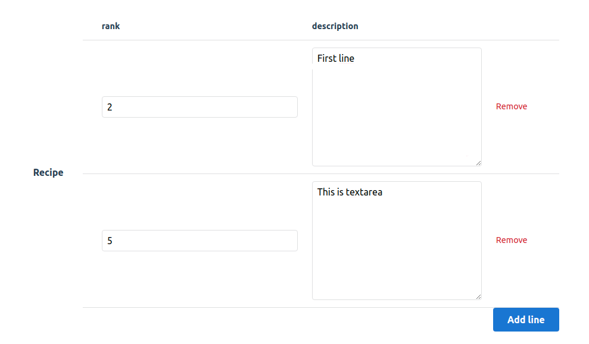
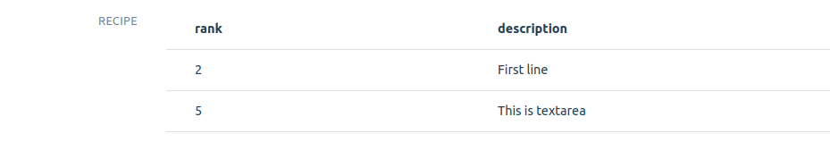

# Administrate::Field::JSONArray

A plugin to show and edit JSON objects within [Administrate](https://github.com/thoughtbot/administrate). inspired by [Administrate::Field::JSON](https://github.com/eddietejeda/administrate-field-json).

## Installation

Add this line to your application's Gemfile:

```ruby
gem 'administrate-field-json_array'
```

And then execute:

```bash
bundle
```

If you are using asset pipeline, add the following lines to your `manifest.js`:

```js
//= link administrate-field-json_array/application.css
//= link administrate-field-json_array/application.js
```

The manifest file is at `app/assets/config` by default.

## Usage

You shoud pass `schema` to describe what inputs will be generate.
Currently supported `:number`, `:text`(textarea) and `:string`.

```ruby
ATTRIBUTE_TYPES = {
  # ...
  details: Field::JSONArray.with_options(schema: { recipe: :number, description: :text }),
}.freeze
```

## How it looks like

### Form



### Show



## Recipes

### Store in jsonb

If you want to store your JSON in hash format and not a string add this to your model.

```ruby
def your_field_name=(value)
  self[:your_field_name] = value.is_a?(String) ? JSON.parse(value) : value
end
```

Example:

```ruby
def details=(value)
  self[:details] = value.is_a?(String) ? JSON.parse(value) : value
end
```

### I18n

You can translate table headers like this

```yaml
ru:
  activerecord:
    attributes:
      your_model:
      recipe_field:
        add: Добавить строку
        keys:
          rank: Номер
          description: Описание
```


## License

[MIT License](https://opensource.org/licenses/MIT).
